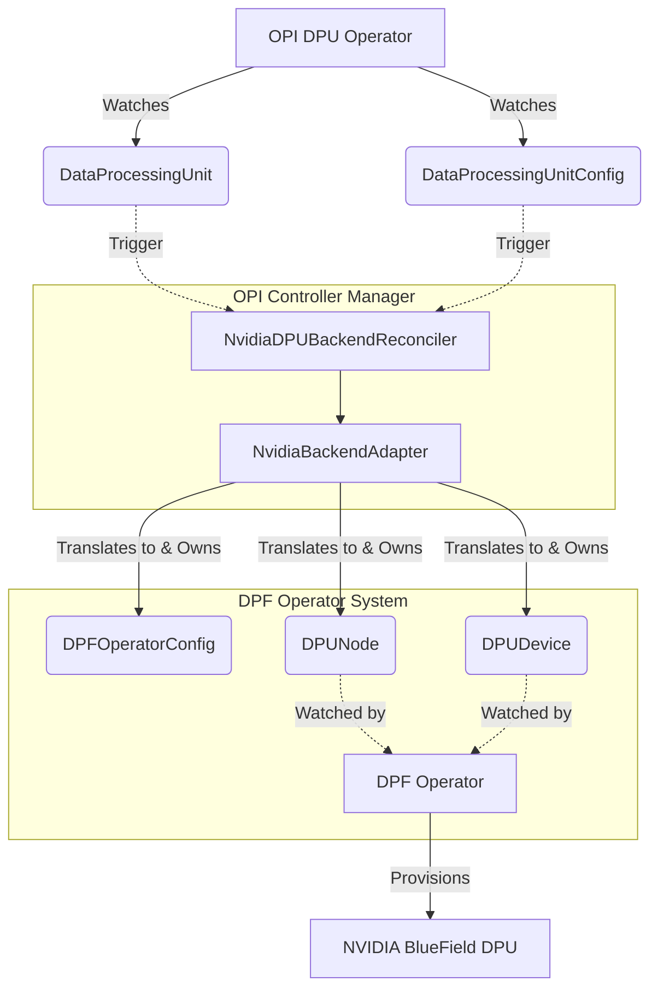
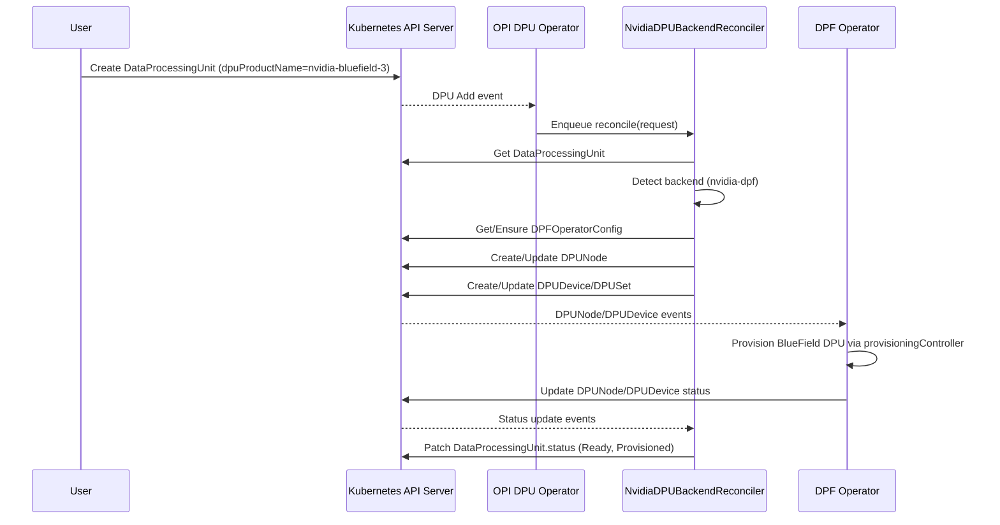
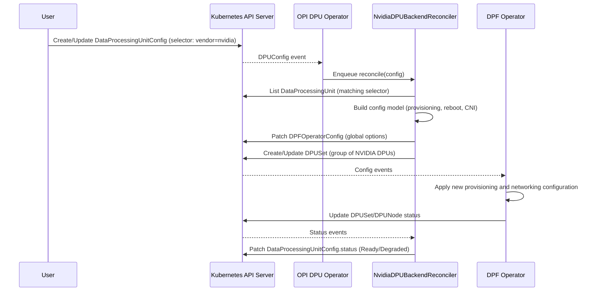

# NVIDIA DPF Integration Architecture for OPI DPU Operator

## Overview

This document proposes an architecture to integrate NVIDIA BlueField DPUs, managed today by the DOCA Platform Framework (DPF) operator, into the vendor-neutral Open Programmable Infrastructure (OPI) DPU operator stack used in OpenShift/Kubernetes environments.

The design keeps the OPI DPU operator as the single control-plane entry point for DPU lifecycle and feature configuration, while delegating NVIDIA-specific provisioning and networking constructs to the existing DPF operator via a well-defined adapter and CRD translation layer.

## Existing Components

### OPI DPU Operator

The OPI DPU operator exposes the following key custom resources:

- **DataProcessingUnit (DPU)** – Cluster-scoped CRD describing a physical DPU instance, including node placement and vendor product name.
- **DataProcessingUnitConfig (DPUConfig)** – Namespaced CRD that selects a subset of DPUs via label selectors and applies feature-level configuration.
- **DpuOperatorConfig** – Cluster-scoped singleton controlling global behavior (e.g., logging and shared vendor-specific resources).

The `DataProcessingUnitReconciler` follows standard controller-runtime patterns: it watches `DataProcessingUnit` resources, resolves node details, discovers vendor characteristics via a `DpuDetectorManager`, and renders vendor-specific plugin (VSP) resources from embedded templates, owning subordinate Pods, ServiceAccounts, Roles, and RoleBindings.

### NVIDIA DOCA Platform Framework (DPF) Operator

The NVIDIA DPF operator manages BlueField DPUs through a set of CRDs and controllers including:

- **DPFOperatorConfig** – Singleton configuration CRD controlling global behavior and optional components like provisioning controller, CNI installers, and cluster managers.
- **DPUNode** – CRD representing a host with one or more attached DPUs, including reboot method, Device Management Service (DMS) address, and node association.
- Additional CRDs such as `DPUDevice`, `DPUSet`, `DPUCluster`, and `DPUDiscovery` for device-level and cluster-level orchestration.

DPF controllers reconcile these resources to provision BlueField DPUs (via host agent, gNOI, or Redfish), manage CNI and Open vSwitch configuration, and integrate DPU nodes into Kubernetes clusters.

## Integration Goals

The proposed architecture must satisfy the following objectives:

1. **Vendor-neutral control surface** – Users should express desired DPU behavior via OPI CRDs (`DataProcessingUnit` and `DataProcessingUnitConfig`) regardless of vendor.
2. **Maximal reuse of DPF** – NVIDIA-specific provisioning, reboot coordination, and networking stack configuration should reuse the existing DPF operator without duplicating logic.
3. **Kubernetes-native patterns** – Integration must follow controller-runtime conventions: reconciliation loops, owner references, informers, and finalizers, avoiding side-channel orchestration.
4. **Loose coupling** – OPI and DPF should remain separately deployable, with clear failure boundaries and optional presence of NVIDIA support in clusters without BlueField.

## High-Level Architecture

### Component Architecture Diagram

### Core Idea

Introduce a **NVIDIA integration sub-controller** inside the OPI DPU operator that:

- Watches `DataProcessingUnit` resources whose `dpuProductName` matches NVIDIA BlueField products.
- Creates and maintains corresponding DPF resources (`DPUNode`, `DPUDevice`, `DPUSet`) in the `dpf-operator-system` namespace.
- Translates `DataProcessingUnitConfig` objects targeted at NVIDIA DPUs into vendor-specific DPF configuration fields (e.g., provisioning controller options, reboot methods, CNI options) through an internal adapter.

This results in an **adapter pattern** where OPI is the canonical API and DPF is an implementation backend for NVIDIA hardware.

### Main Pieces

1. **NvidiaBackendAdapter (library)** – Pure Go component that encapsulates mapping between OPI CRDs and DPF CRDs.
2. **NvidiaDPUBackendReconciler (controller)** – Controller-runtime reconciler registered by the OPI operator, responsible for NVIDIA-specific synchronization.
3. **CRD Translation Layer** – Stateless mapping logic between `DataProcessingUnit` / `DataProcessingUnitConfig` and DPF CRDs.
4. **Capability Discovery** – Uses `DpuDetectorManager` plus vendor annotations to decide whether a DPU should be handled by DPF or another vendor backend.

## CRD Mapping Design

### DataProcessingUnit → DPUNode / DPUDevice

For each `DataProcessingUnit` with `spec.dpuProductName` equal to a recognized NVIDIA identifier (for example `nvidia-bluefield-3`), the adapter creates:

- A `DPUNode` resource in `dpf-operator-system` with:
  - `metadata.name` derived from `DataProcessingUnit.spec.nodeName`.
  - `spec.nodeRebootMethod` set based on policy in `DataProcessingUnitConfig` (default `gNOI`).
  - `spec.nodeDMSAddress` populated from cluster-level configuration (possibly in a `ConfigMap` referenced by `DpuOperatorConfig`).
- Corresponding `DPUDevice` resources (one per physical DPU on the node), with names derived from `DataProcessingUnit.metadata.name` and any vendor-provided identifiers.

Since `DataProcessingUnit` is cluster-scoped and DPF resources are namespaced, cross-namespace OwnerReferences are invalid. Instead, the `NvidiaDPUBackendReconciler` uses finalizers on the `DataProcessingUnit` to track and explicitly clean up associated DPF resources in `dpf-operator-system` namespace when the DPU is deleted.

### DataProcessingUnitConfig → DPFOperatorConfig / DPUSet

`DataProcessingUnitConfig` contains a `dpuSelector` field that selects target DPUs using label selectors. For NVIDIA DPUs, the integration layer:

- Resolves the selector to a concrete set of `DataProcessingUnit` objects.
- For each matching DPU, ensures presence of associated DPF resources.
- Aggregates configuration into either:
  - Cluster-wide knobs in `DPFOperatorConfig` (e.g., provisioning controller parallelism, Redfish install interface).
  - Per-group `DPUSet` objects capturing homogeneous configuration for a subset of DPUs.

Configuration fields that cannot be represented directly in existing OPI CRDs (for example, detailed Redfish BFB registry parameters) are exposed through vendor-specific nested structs inside `DataProcessingUnitConfig.spec`, kept behind an interface that other vendors can implement differently.

## Controller Interaction and Reconciliation Flow

### Reconciliation Triggers

The `NvidiaDPUBackendReconciler` is registered to watch:

- `DataProcessingUnit` objects (primary resource).
- `DataProcessingUnitConfig` objects (secondary resource with mapper to affected DPUs).
- Selected DPF CRDs (`DPUNode`, `DPUDevice`, `DPUSet`) for status reflection.

### Flow for DataProcessingUnit

1. **Fetch DPU** – Load `DataProcessingUnit` and validate `spec.dpuProductName` against known NVIDIA detectors.
2. **Capability decision** – If NVIDIA, mark `DataProcessingUnit` with an annotation such as `opi.dpu.backend=nvidia-dpf` and proceed; otherwise ignore.
3. **Ensure DPFOperatorConfig** – Verify that a singleton `DPFOperatorConfig` exists and is in `Ready` phase; if missing, surface a `BackendNotReady` condition on the DPU status.
4. **Create / update DPUNode** – Reconcile `DPUNode` with correct reboot method, DMS address, and attached DPU list.
5. **Create / update DPUDevice / DPUSet** – Ensure device CRDs reflect the desired state (provisioned firmware, networking configuration).
6. **Reflect status** – Copy relevant conditions (e.g., provisioning success, reboot in progress) from DPF resources into the `DataProcessingUnit.status.conditions` array so users see a unified status surface.

### Flow for DataProcessingUnitConfig

1. **Fetch DPUConfig** – Load `DataProcessingUnitConfig` and compute the set of matching DPUs using the embedded `dpuSelector` label selector semantics.
2. **Partition DPUs** – Group DPUs by backend type; for NVIDIA group, invoke the `NvidiaBackendAdapter`.
3. **Update DPFOperatorConfig** – Set provisioning parameters (parallelism, timeouts, install interface) according to OPI configuration.
4. **Update DPUSet** – For NVIDIA DPUs, ensure that a `DPUSet` exists with appropriate configuration, such as desired firmware bundle PVC, Redfish registry endpoints, and node drain behavior.
5. **Status propagation** – Surface aggregated readiness or configuration errors back onto `DataProcessingUnitConfig.status`.

## Sequence Diagrams (Mermaid)

### DPU Creation and NVIDIA Backend Provisioning

### Configuration Application via DataProcessingUnitConfig

## Trade-Off Analysis

### Adapter Pattern vs. Direct Embedding

- **Pros (Adapter Pattern)**:
  - Preserves separation of concerns: OPI owns vendor-neutral API; DPF owns NVIDIA-specific logic.
  - Enables independent evolution of DPF without requiring changes in OPI CRD schemas.
  - Makes it possible to add other vendor backends (e.g., AMD) by implementing parallel adapters without modifying core controllers.

- **Cons**:
  - Requires careful status mapping and error propagation to avoid confusing users.
  - Introduces additional controller-manager complexity inside the OPI operator deployment.

### Sub-Operator vs. External Controller

- **Inline Sub-Controller (chosen)**:
  - Runs within the same controller-manager process as OPI, simplifying RBAC and avoiding cross-namespace leader election.
  - Allows tight coupling to `DpuDetectorManager` and shared utilities.

- **Separate Sub-Operator Deployment**:
  - Would yield clearer operational boundaries but requires separate lifecycle management and potentially more complex CRD ownership semantics.

Given the goal of a unified OPI operator ecosystem, embedding `NvidiaDPUBackendReconciler` in the existing OPI controller-manager is the preferred choice.

### Error and Degraded State Handling

To ensure robust operation, the adapter addresses several edge cases:
- **DPF Operator Not Installed**: If `DPFOperatorConfig` cannot be found or is not installed, the reconciler updates the `DataProcessingUnit` status with a `BackendNotReady` condition.
- **Failed Provisioning**: If DPF resources enter a non-Ready state, these states are propagated directly into `DataProcessingUnit.status.conditions` to provide visibility.
- **Reconciliation Timeouts**: Network partitions or API latency during status reflection trigger standard controller-runtime requeues with exponential backoff.

### CRD Translation Layer Scope

- **Minimalist Approach (chosen)**:
  - Only maps essential DPU lifecycle and networking configuration fields from OPI to DPF, leaving highly vendor-specific knobs in dedicated sub-structs.
  - Reduces risk of OPI becoming a thin veneer over entirely vendor-specific APIs.

- **Exhaustive Mapping**:
  - Full mirroring of DPF CRDs inside OPI would undermine vendor neutrality and complicate long-term schema maintenance.

## Kubernetes Operator Alignment

The proposed design adheres to common operator patterns:

- Controllers are built with `controller-runtime`, using `Reconcile(ctx, req)` semantics and returning `ctrl.Result` for requeue behavior.
- RBAC rules allow the OPI operator to read and write both its own CRDs and DPF CRDs, constrained to the `dpf-operator-system` namespace where possible.
- Since `DataProcessingUnit` is cluster-scoped and DPF resources are namespaced, cross-namespace OwnerReferences are not valid. Instead, finalizers on `DataProcessingUnit` objects ensure that DPF resources are explicitly cleaned up before the DPU is removed (e.g., `dpu.opi.io/nvidia-backend-finalizer`). The reconciler deletes associated DPF resources in the `dpf-operator-system` namespace during finalization, then removes the finalizer.
- For namespaced OPI resources like `DataProcessingUnitConfig`, standard OwnerReferences can be used on same-namespace DPF resources where applicable.

These patterns ensure that NVIDIA support behaves like any other backend within the OPI ecosystem, exposing a consistent API surface to users while leveraging DPF for heavy lifting.

## Extension to AMD and Other Vendors

Although this document focuses on NVIDIA DPF, the same architecture can be extended to AMD or additional vendors:

- Define `AmdDPUBackendReconciler` and `AmdBackendAdapter` using AMD-provided CRDs or APIs.
- Use the existing `DataProcessingUnit` and `DataProcessingUnitConfig` CRDs as the stable control surface.
- Add detection logic in `DpuDetectorManager` and template rendering to support AMD-specific plugin Pods and offload stacks.

This keeps OPI as the long-term standard while unlocking ecosystem growth through backend adapters.

