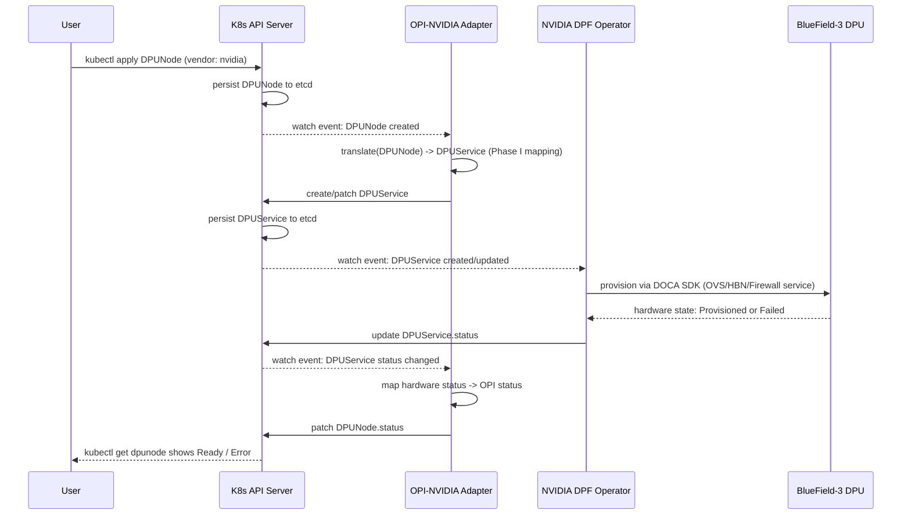

# LLM-Assisted Architecture Design: OPI–NVIDIA DPF Integration

**Assignment 1 — OPI DPU Operator, NVIDIA Vendor Support**

## 1. Problem Statement

The OPI (Open Programmable Infrastructure) DPU Operator defines a vendor-neutral
Kubernetes CRD schema for managing DPU/IPU hardware, with working reconciliation
logic today for Intel and Marvell devices. NVIDIA maintains a separate, independent
operator — DPF (DOCA Platform Framework) — which fully manages BlueField-3 DPUs
through its own CRDs, but has no awareness of OPI's schema.

As a result, a user targeting NVIDIA hardware through OPI's unified interface hits
a dead end: OPI's operator has no reconciliation path for `vendor: nvidia`, and the
user is forced to bypass OPI and interact with DPF's CRDs directly — defeating the
purpose of a vendor-neutral standard.

**Goal:** design an integration that lets a user's OPI CRD result in NVIDIA hardware
being correctly configured, while maximizing reuse of DPF's existing, unmodified
operator (i.e., without reimplementing DPF's internal logic inside OPI).

## 2. Proposed Architecture: Adapter Pattern

We introduce a new, independently deployed Kubernetes controller — the
**OPI–NVIDIA Adapter** — that sits between the two systems as a pure translation
layer:

- It watches OPI `DPUNode` custom resources.
- When it detects `spec.vendor: nvidia`, it computes an equivalent NVIDIA DPF
  `DPUService`/`DPUDeployment` object using a deterministic field-mapping function.
- It creates or patches that DPF object in the cluster.
- NVIDIA's own DPF operator — completely unmodified — reconciles that object as it
  normally would, driving the real BlueField-3 hardware configuration via the
  DOCA SDK.
- The Adapter watches the resulting DPF object's `.status` and mirrors relevant
  fields back onto the original OPI object's `.status`, so the user's
  `kubectl get dpunode` reflects the true hardware state without the user ever
  needing to know DPF exists.

This pattern was chosen over two alternatives — **Sub-operator** (baking NVIDIA
logic directly into OPI's own reconcile function) and **Mutating Admission
Webhook** (translating synchronously at write-time) — for reasons detailed in
Section 5.

### Why this satisfies "maximize reuse of DPF"

The Adapter never re-implements DOCA SDK calls, firmware provisioning, or any
BlueField-specific logic. It only produces a DPF-native object; 100% of the actual
hardware actuation logic remains inside DPF's own, already-mature operator.

## 3. Sequence Diagram

## 4. CRD Field Mapping (Translation Matrix)

Representative mapping for a network-interface (vNIC) provisioning scenario:

| OPI Field (`DPUNode`) | DPF Field (`DPUService`) | Transformation Logic |
|---|---|---|
| `metadata.name` | `metadata.name` | Direct mapping; suffix appended (e.g. `-dpf`) to avoid namespace collisions |
| `spec.macAddress` | `spec.interfaces[].macAddress` | Direct pass-through |
| `spec.vlanId` | `spec.network.vlan` | Type conversion (integer format alignment) |
| `spec.endpoint` | `spec.nodeSelector` | Logical mapping: OPI's abstract endpoint → concrete `kubernetes.io/hostname` selector targeting the specific DPU |
| `spec.qos.bandwidthLimit` | `spec.qosConfig.maxBandwidth` | Unit normalization (e.g. Gbps → bytes/sec) |

**Static overrides injected by the Adapter** (fields DPF requires that OPI never
supplies): `spec.serviceType` (which DOCA service to run — OVS/HBN/Firewall,
selected based on the OPI CRD kind), `spec.image` (DOCA microservice container
image reference), `spec.credentials` (secret references for image pulls / BMC
access).

**Ownership tracking:** the Adapter sets an `OwnerReference` on the DPF object
pointing back to the originating OPI object (`ownerReferences[].uid` =
OPI object's `metadata.uid`), so that deleting the OPI object causes Kubernetes to
automatically garbage-collect the corresponding DPF object.

## 5. Trade-off Analysis

| Dimension | Adapter (chosen) | Sub-operator | Mutating Webhook |
|---|---|---|---|
| Coupling to DPF's API | Low — isolated process/deployment | High — compiled dependency inside OPI's core | Medium |
| Failure isolation | High — adapter crash doesn't affect OPI's or DPF's core loops | Low — a bug can crash OPI's core reconciliation | Low — can block all matching writes cluster-wide if misconfigured |
| Extensibility to a future vendor | High — deploy another adapter | Low — requires editing OPI's core switch-statement | Medium |
| Execution model | Asynchronous, eventually consistent | Asynchronous, eventually consistent | Synchronous, blocking |
| Reuse of DPF's existing logic | Full — DPF untouched | Full, but duplicates ownership boundary | Full |

**Adapter is recommended** because it best satisfies the explicit brief requirement
to maximize reuse of DPF's existing operator, isolates failure domains (a bug in
the translation layer cannot destabilize OPI's core reconciliation of Intel/Marvell
hardware), and generalizes cleanly if a future vendor requires the same treatment.

Its main weakness is **staleness risk**: translation is asynchronous, so there is a
brief window where `DPUNode.status` may lag the true DPF/hardware state. This is
considered acceptable given Kubernetes' general eventual-consistency model.

## 6. Verification & Edge Cases

- **Constraint satisfaction**: the Adapter should validate the translated
  `DPUService` object against DPF's OpenAPI schema before writing it, rejecting
  and surfacing errors (e.g., an out-of-range VLAN ID) onto `DPUNode.status`
  rather than failing silently.
- **Idempotency**: repeated reconciliation of an unchanged `DPUNode` must produce
  no additional writes — verified by comparing computed vs. existing `DPUService`
  spec with `reflect.DeepEqual` before issuing an `Update`.
- **Drift/conflict**: if a `DPUService` object is manually edited outside the
  Adapter, the next reconcile pass must detect the mismatch and overwrite it back
  to the Adapter-computed state — the Adapter is the sole source of truth for
  DPF objects it owns.
- **Deletion**: deleting a `DPUNode` must result in automatic garbage collection
  of the corresponding `DPUService` via `OwnerReference`, without the Adapter
  issuing an explicit delete call.

## 7. Assumptions & Limitations

- Exact DPF CRD field names (`DPUService`/`DPUDeployment`, its schema) are based
  on publicly available DPF documentation and reasonable inference; the real
  current DPF release may use different field names, requiring the mapping table
  in Section 4 to be adjusted.
- This design assumes a 1:1 mapping between an OPI `DPUNode` and a DPF service
  object is sufficient for common cases (e.g., basic network offload); more
  complex OPI resource kinds (storage, security policies) would require
  additional mapping tables following the same pattern.
- Full primary-datapath OVN offload (as opposed to discrete network-function
  offload) may require a richer DPF object graph than modeled here; this design
  targets the core translation mechanism, not an exhaustive schema mapping.
