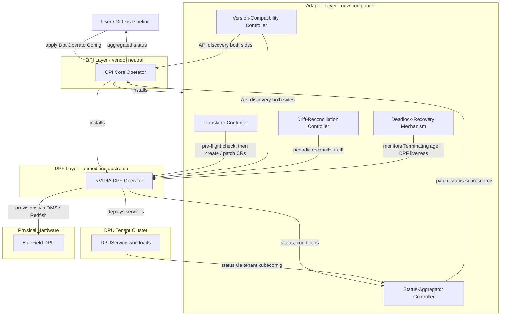
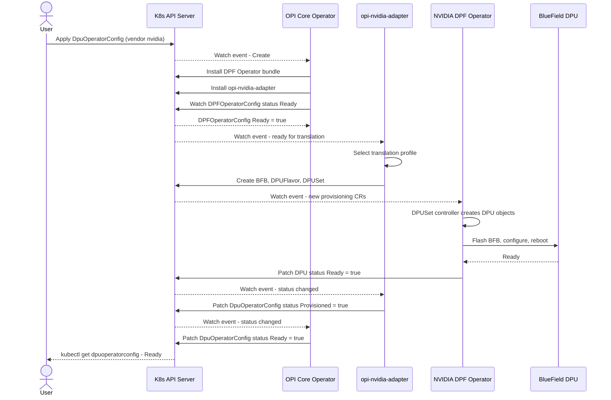
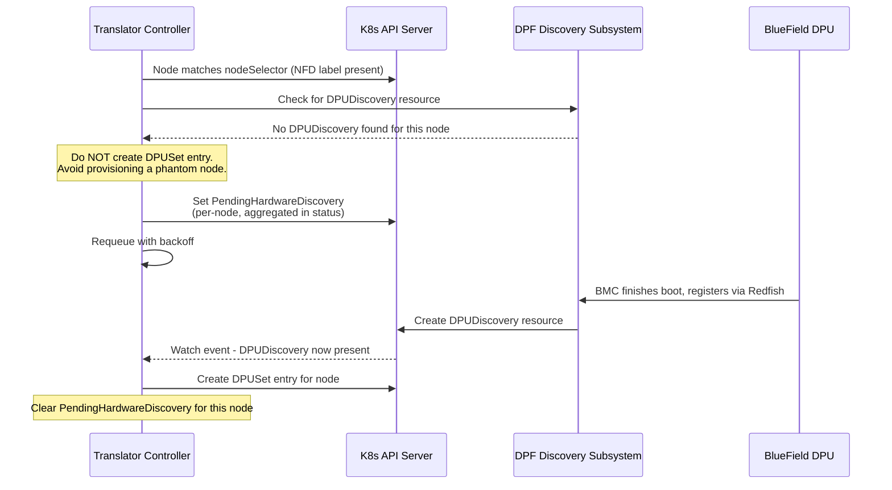
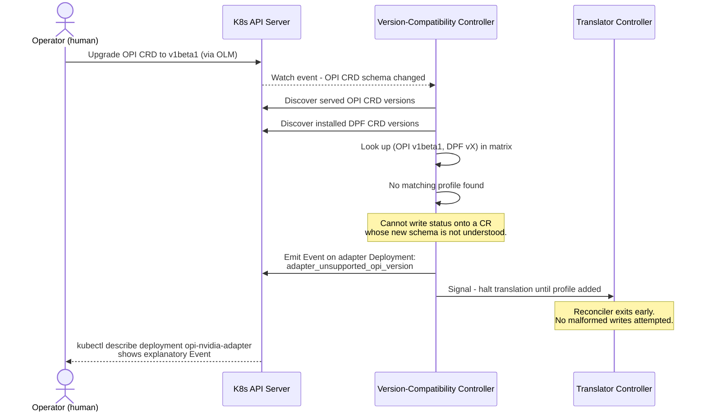
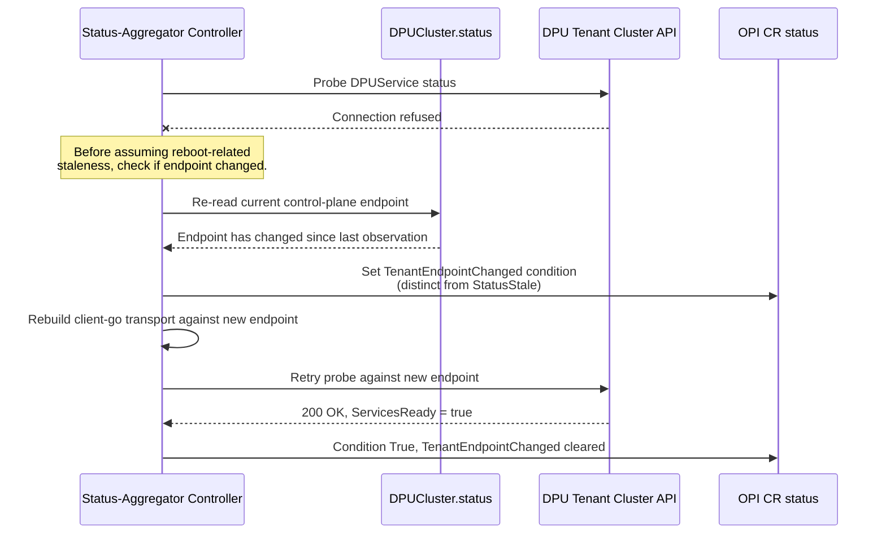
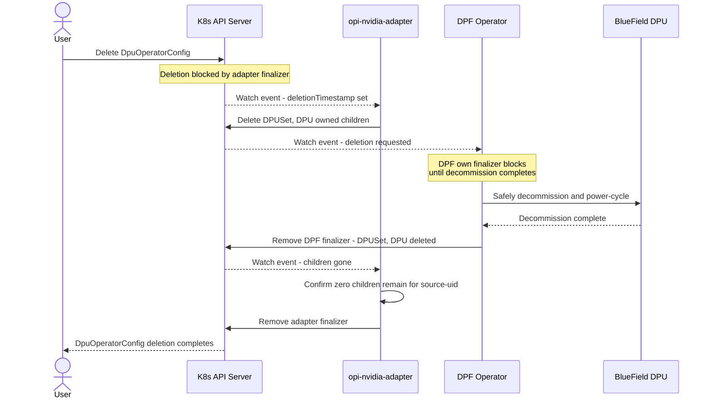
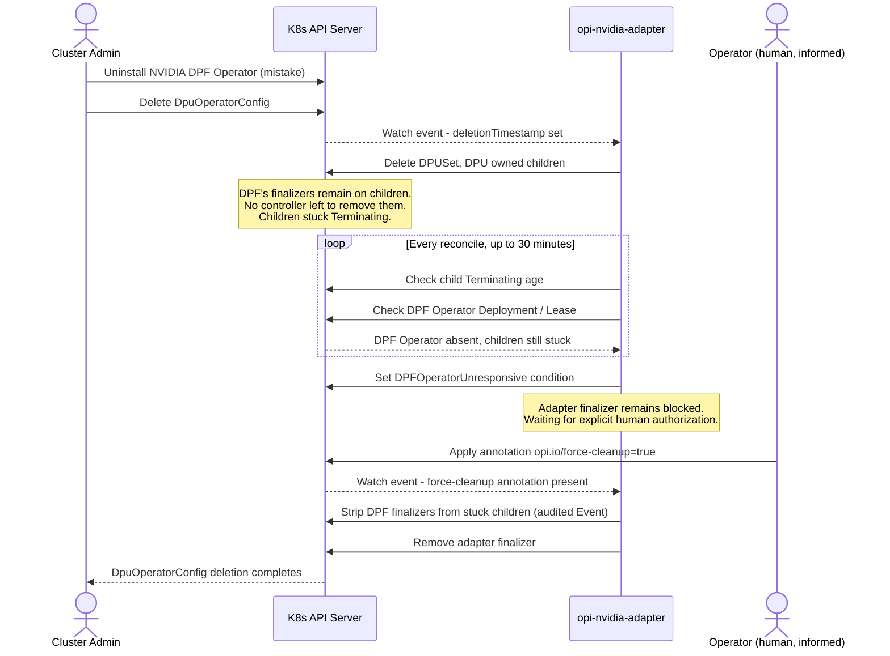

# NVIDIA DPF Integration into the OPI DPU Operator

**Author:** Divyansh Yadav  
**Document Type:** Final Architecture Proposal  
**Scope:** Bring NVIDIA BlueField DPU support into the vendor-neutral OPI DPU Operator by maximally reusing the existing NVIDIA DOCA Platform Framework (DPF) Operator.

---

# 1. Final Architecture Proposal

## 1.1 Grounding

Two real, independently-maintained systems are being unified:

- **OPI DPU Operator** — a Kubebuilder-based Go operator whose top-level CRD is `DpuOperatorConfig`. It supports a **single-cluster** and a **two-cluster (host + DPU) topology**, and already branches internally per vendor (Intel IPU, Marvell OCTEON) once hardware is detected via Node Feature Discovery (NFD) labels. As a Linux Foundation standard, OPI's own CRDs are expected to evolve (`v1alpha1` → `v1beta1` → `v1`) at a pace independent of any single vendor bridge.
- **NVIDIA DPF Operator** (`NVIDIA/doca-platform`) — owns provisioning (`BFB`, `DPUFlavor`, `DPUSet`, `DPU`, `DPUCluster`, `DPUNode`, `DPUDiscovery` — group `provisioning.dpu.nvidia.com`) and service orchestration (`DPUService`, `DPUServiceChain`, `DPUServiceIPAM`, `DPUServiceNAD` — group `svc.dpu.nvidia.com`), configured via `DPFOperatorConfig` (group `operator.dpu.nvidia.com`). It also assumes a host/DPU-tenant-cluster split, provisions BlueField DPUs via a Device Management Service (DMS) + Redfish/BMC, and stands up the DPU-side control plane via Kamaji or a static-cluster manager.

The topological alignment between the two projects is what makes a clean adapter integration possible instead of a forced one.

## 1.2 Chosen Pattern: Translation-Adapter Operator (Provider Model)

A new, independently-deployable, single-responsibility operator — **`opi-nvidia-adapter`** — mediates between OPI's vendor-neutral CRDs and DPF's vendor-specific CRDs. Neither existing operator is modified.

| Option considered | Why rejected / accepted |
|---|---|
| **A. Extend OPI's CRD with `spec.nvidia{}` and reimplement provisioning inside OPI core** | Duplicates DPF's hardware-tested provisioning logic; every DPF change forces an OPI core release; breaks vendor neutrality. **Rejected.** |
| **B. Fork/vendor DPF's controller source into OPI's codebase** | Permanent patch/security burden, loses NVIDIA's upstream release velocity and hardware certification. **Rejected.** |
| **C. Import DPF's Go packages and run their reconcilers in-process inside the OPI binary** | Couples two independently-versioned dependency graphs and failure domains into one process. **Rejected.** |
| **D. Translation-Adapter Operator — separate process, watches both APIs, DPF runs completely untouched** | Preserves OPI as sole source of user intent and DPF as an untouched upstream dependency; matches OPI's own "bridge" convention (`opi-intel-bridge`, `opi-marvell-bridge`); fault-isolated; independently versioned and tested. **Selected.** |

This mirrors Cluster API's Core/Infrastructure-Provider split and Crossplane's Composition model.

## 1.3 Component Breakdown (LLD)

| Component | New / Existing | Responsibility |
|---|---|---|
| `DpuOperatorConfig`, `DpuDevice` CRDs | Existing (OPI) | User-facing, vendor-neutral desired state; schema itself versioned by OPI upstream |
| **OPI Core Operator** | Existing | On `spec.vendor: nvidia`, installs a pinned DPF Operator bundle *and* the adapter; sole component the user queries for status |
| **`opi-nvidia-adapter`** | **New** | A `controller-runtime` manager, deployed only when NVIDIA hardware is targeted, running with **leader election enabled** and exactly one active replica (§1.4.1) |
| ↳ Translator Controller | New | OPI CR (spec) → DPF CRs, idempotent, server-side-apply based. Gated by a **hardware pre-flight check** (§1.4.9) before creating any provisioning object |
| ↳ Status-Aggregator Controller | New | DPF CR status (host **and** DPU tenant cluster) → OPI CR `/status` subresource only. Performs **endpoint-change detection before assuming reboot-related staleness** (§1.4.12) |
| ↳ Version-Compatibility Controller | New | Discovers **both** the installed DPF CRD schema **and** the served OPI CRD schema; selects a translation strategy from a **two-axis** `[OPI version] × [DPF version]` matrix, or halts with a visible terminal condition (§1.4.8) |
| ↳ Drift-Reconciliation Controller | New | Periodic re-list + diff against DPF children to detect manual edits/deletes of adapter-owned objects (§1.4.7) |
| ↳ Deadlock-Recovery mechanism | New | Monitors elapsed `deletionTimestamp` age on DPF child objects and DPF operator liveness; provides an audited emergency escape hatch (§1.4.6) |
| DPF Operator | Existing, unmodified | Owns hardware provisioning and service orchestration exactly as it does standalone |
| Translation Profile matrix | New | Versioned Strategy-pattern package, keyed on `(OPI schema version, DPF schema version)`, not DPF version alone |

Owner references on translated DPF objects point to the **OPI CR**, not vice versa — deliberate, so garbage collection cannot outrun the adapter's own finalizer logic (§1.4.5, §1.4.6).

RBAC is structured so that **only the adapter's ServiceAccount** can touch `provisioning.dpu.nvidia.com` / `svc.dpu.nvidia.com` resources, scoped to the `dpf-operator-system` namespace, with read-only access to the `DPUCluster` tenant kubeconfig `Secret`. The OPI Core Operator never speaks "DPF" directly.

## 1.4 Foolproofing: Edge Cases and Resilience Mechanisms

Each item follows the same discipline: **naive behavior → failure mode → structural fix.**

### 1.4.1 Concurrent adapter replicas (HA / rolling upgrade race)
- **Naive:** Running 2+ adapter replicas, both reconciling the same OPI CR during a rolling upgrade.
- **Failure:** Conflicting writes to the same DPF child objects; duplicate `Create` calls or divergent local caches producing contradictory patches.
- **Fix:** `controller-runtime` leader election via a `Lease`; only the leader's reconcilers run. Lease tuned (10s duration, 2s renew deadline) for a bounded failover window.

### 1.4.2 Dual-writer race on DPF objects
- **Naive:** OPI Core Operator writes "simple" DPF objects directly, delegating only "complex" cases to the adapter.
- **Failure:** Two controllers race on `resourceVersion`; stale-spec re-application produces flapping desired state or split-brain ownership.
- **Fix:** RBAC makes it structurally impossible for OPI core to write DPF resources — exactly one writer per API group. Server-side apply with a stable field manager name, idempotent by construction.

### 1.4.3 Non-atomic multi-object fan-out
- **Naive:** Translator creates `BFB`, then `DPUFlavor`, then `DPUSet` as sequential, one-shot calls.
- **Failure:** Pod eviction between steps leaves an orphaned, invisible partial state.
- **Fix:** Every reconcile re-derives and re-applies the **complete** desired child-object set via SSA, regardless of what already exists. `TranslationComplete` only set once all expected children exist.

### 1.4.4 Cross-cluster status observation failure (network partition during reboot)
- **Naive:** Any tenant-cluster read failure is treated as "not ready."
- **Failure:** BlueField DPUs legitimately reboot mid-provisioning; flipping straight to `False` produces false alarms.
- **Fix:** Failed observations set `Unknown`, never directly `False`. Downgrade to `False` requires N consecutive failed probes over a minimum window (default 3 / 90s). A `StatusStale` condition exposes observation age. *(Ordering with §1.4.12 below matters — see that entry.)*

### 1.4.5 Deletion during in-flight hardware operations (DPF healthy)
- **Naive:** OPI CR directly owns DPF CRs; deleting the OPI CR cascades immediate deletion.
- **Failure:** Deletion mid-firmware-flash can leave a device partially flashed while the OPI CR reports "gone."
- **Fix:** Bottom-up, two-tier finalizer chain — the adapter's finalizer blocks until DPF's own finalizer-driven decommission/power-cycle sequencing completes and child objects are confirmed absent.

### 1.4.6 Finalizer deadlock — DPF Operator uninstalled mid-cleanup ("Abandoned Bridge")
- **Naive:** §1.4.5's finalizer chain implicitly assumes the DPF Operator is always alive to process the finalizers it places on its own objects.
- **Failure:** A cluster administrator uninstalls the NVIDIA DPF Operator (accidentally, or during a botched migration) before deleting the corresponding OPI CRs. The adapter issues `Delete` on the `DPUSet`/`DPU` children as designed, but those objects carry **DPF's own finalizers**, and with no DPF controller running, nothing ever removes them. The objects sit in `Terminating` forever. Because the adapter's finalizer removal is gated on those children being fully gone (§1.4.5), the adapter's finalizer never comes off the OPI CR either. **The entire OPI management plane for that node group is now permanently deadlocked** — not merely slow, but structurally unrecoverable without manual `kubectl` surgery on live finalizers, which is exactly the dangerous, undocumented workaround this design exists to avoid forcing on operators.
- **Fix:** The Deadlock-Recovery mechanism tracks elapsed time since `deletionTimestamp` was set on each DPF child object, and independently checks for DPF Operator liveness (absence of its `Deployment`/leader `Lease`). If a child object remains `Terminating` beyond a highly generous timeout (default 30 minutes — chosen to comfortably exceed any legitimate flash/reboot/decommission cycle) **and** the DPF Operator is confirmed absent or non-responsive, the adapter sets a `DPFOperatorUnresponsive` condition on the OPI CR — visible, not silent. Unblocking requires an explicit, human-applied emergency annotation on the OPI CR, `opi.io/force-cleanup: "true"`. Only once a human has applied this annotation does the adapter forcibly strip DPF's finalizers from the stuck child objects and complete its own finalizer removal. This action is never automatic, is emitted as a high-severity Kubernetes `Event` and audit log entry, and is checked against DPF's actual absence (not merely slowness) so it cannot be triggered by a healthy-but-busy DPF operator.

### 1.4.7 Configuration drift from out-of-band edits
- **Naive:** Assume DPF child objects are only ever touched by the adapter.
- **Failure:** A `kubectl edit dpuset` during an incident silently diverges live state from declared intent indefinitely.
- **Fix:** Drift-Reconciliation Controller periodically (default 5 min) re-lists labeled DPF objects and re-applies desired state via SSA. An `opi.io/unmanaged: "true"` escape-hatch annotation allows deliberate manual override, surfaced as `ManualOverrideActive` rather than silently honored.

### 1.4.8 Bidirectional API/CRD version mismatch — DPF **and** OPI
- **Naive (as originally proposed):** A `Version-Compatibility Controller` that only discovers and reacts to changes in the **DPF** CRD schema, with the OPI-side schema hardcoded as a compile-time Go struct.
- **Failure:** OPI is an actively evolving open standard in its own right, not a fixed contract. When the OPI Core Operator (or a cluster admin via OLM) upgrades `DpuOperatorConfig` from `v1alpha1` to `v1beta1`, the adapter's informer — still typed against the old struct — either silently drops new fields it doesn't recognize (a user's new configuration is accepted by the API server but never actually acted on) or, if `v1alpha1` stops being a served version entirely during a storage-version migration, the adapter's watch breaks outright (`NotFound`/`410 Gone` on List/Watch), and the adapter goes **completely blind to new or updated OPI CRs with no visible error surfaced anywhere a user would look**, since it can no longer write status onto a resource type it can no longer read.
- **Fix:** The translation matrix is redefined as genuinely two-dimensional: `(OPI schema version, DPF schema version) → Translator implementation`, not a DPF-only lookup. The Version-Compatibility Controller performs API discovery against **both** CRD sets at startup and on any watch event against either's `CustomResourceDefinition` object. Where OPI's CRD conversion webhook supports multiple served versions simultaneously (the standard Kubernetes CRD migration pattern), the adapter registers informers against the versions it supports and relies on that webhook for conversion rather than reimplementing it. If the currently-served OPI version has **no** matching profile, the adapter cannot safely write a condition onto a resource whose schema it doesn't understand — instead it emits a Kubernetes `Event` scoped to its own Deployment/Pod plus a `adapter_unsupported_opi_version` metric, ensuring the failure is still observable via `kubectl describe` and standard monitoring even though it cannot appear on the OPI CR's own status.

### 1.4.9 Hardware discovery race — phantom node provisioning
- **Naive:** The Translator Controller reacts purely to the OPI CR's `nodeSelector` matching Kubernetes `Node` labels (NFD's `feature.node.kubernetes.io/dpu-enabled=true`), treating a matching label as proof that functioning, DPF-reachable hardware exists.
- **Failure:** An NFD label reflects PCI-level device enumeration at the OS/kernel layer and can be stale or misleading — a physically dead DPU, a card stuck in a bad firmware state, or a card whose BMC hasn't finished booting can still carry the label from its last successful scan. The Translator blindly creates a `DPUSet` targeting that node regardless. DPF then either silently accepts the object and stalls indefinitely in `Provisioning` (indistinguishable from a slow-but-healthy flash) or errors trying to reach a device via DMS that was never actually ready — either way, **the OPI CR reports "provisioning started" while no real hardware is receiving the BFB image**, a disconnected state that can persist far longer than mechanisms designed for already-known-good hardware (§1.4.4) are tuned to tolerate.
- **Fix:** A mandatory pre-flight gate added to the Translator Controller: before creating or patching any `DPUSet` entry targeting a given node, it checks for a corresponding DPF `DPUDiscovery` resource confirming the DPU has been discovered and is DMS-reachable. If none exists yet, the Translator does **not** create the provisioning object for that node; it instead sets a per-node `PendingHardwareDiscovery` condition, aggregated into the OPI CR's status as a fleet-level count (e.g. "3/50 nodes pending hardware discovery"), and requeues with backoff rather than fabricating a provisioning attempt against nothing. A bounded discovery timeout (default 15 min) escalates `PendingHardwareDiscovery` to a distinct `HardwareDiscoveryFailed` condition for that specific node, so operators can immediately tell "the card looks dead" apart from "the card is mid-flash."

### 1.4.10 Self-triggering reconciliation feedback loop
- **Naive:** One controller both watches OPI CRs (spec→DPF) and writes their status (DPF→OPI).
- **Failure:** Each status write generates a new watch event re-entering the same reconciler; nondeterministic status computation can oscillate indefinitely.
- **Fix:** Two independent controllers, two independent watches (Translator uses `predicate.GenerationChangedPredicate`, structurally ignoring status-only updates; Status-Aggregator never watches the OPI CR at all). Deterministic status computation, with writes skipped when unchanged.

### 1.4.11 Reconciliation storm at fleet scale
- **Naive:** Applying a `DpuOperatorConfig` targeting thousands of nodes triggers immediate, unthrottled fan-out.
- **Failure:** A burst of near-simultaneous API calls saturates the API server and DPF's own workqueue.
- **Fix:** Rate-limited adapter workqueue; `DPUSet` creation fans out through DPF's own native `rollingUpdate.maxUnavailable` mechanism rather than the adapter re-implementing per-device throttling.

### 1.4.12 Tenant cluster credential rotation **and** control-plane endpoint mutation
- **Naive:** The adapter rebuilds its tenant-cluster `client-go` client whenever the `DPUCluster` kubeconfig `Secret` is rotated, and otherwise assumes the API server endpoint inside that kubeconfig remains static.
- **Failure:** In Kamaji-backed deployments (the topology this design explicitly targets), tenant control-plane pods can be rescheduled; even with a VIP/Service normally fronting them, keepalived failover, a `TenantControlPlane` recreation, or a DPU-cluster reinstall can leave the kubeconfig **technically well-formed and unexpired, but stale** — pointing at an IP that no longer routes anywhere. Left unresolved, this produces two compounding problems: (a) the Status-Aggregator spams `connection refused` and, worse, (b) under §1.4.4's reboot-tolerance logic, a *permanent* routing change gets misclassified as a *transient* reboot-related partition and is silently absorbed into `Unknown`/`StatusStale` for as long as the tolerance window allows — masking a real, permanent failure behind a mechanism built to tolerate a temporary one, even though the DPU workloads underneath may be running perfectly fine.
- **Fix:** Connectivity failures are classified into three distinct paths, checked in a specific order, rather than two: (1) **auth failure** (`401`/`403`) → `TenantAuthFailure`, unchanged from the original credential-rotation handling; (2) **network-level unreachability** now first triggers a cheap, fast re-check of the `DPUCluster` object's own `.status` (which DPF's cluster-manager implementation, e.g. Kamaji, updates whenever the control plane's routable endpoint changes) and a forced re-read of the `Secret`'s `server:` field, *before* anything is allowed to fall into the reboot-tolerance path; (3) only if the endpoint is confirmed **unchanged** does §1.4.4's reboot-tolerant staleness logic apply. This ordering ensures a genuine, permanent endpoint change is caught and surfaced immediately as its own condition rather than being silently absorbed by the tolerance mechanism built for a different failure class.

### 1.4.13 Least-privilege blast radius if the adapter is compromised
- **Naive:** Grant the adapter broad `cluster-admin`-like access across both clusters "to be safe."
- **Failure:** A compromised or buggy adapter becomes a lateral-movement vector with cluster-wide blast radius.
- **Fix:** RBAC scoped to the minimum viable surface — namespace-scoped `Role` on `dpf-operator-system`, read-only access to exactly one named `Secret`. Enforced in CI via a static RBAC-diff check against a committed "expected minimum permissions" manifest.

---

# 2. Architecture & Sequence Diagrams 

## 2.1 Component & Deployment Topology

Each diagram below is scoped to a single concern so swimlanes stay readable — failure paths are shown as their own focused diagrams rather than folded into the happy path.

## 2.2 Happy-Path Lifecycle — Provisioning a DPU Fleet

## 2.3 Failure Path — Hardware Discovery Preflight Gate

## 2.4 Failure Path — Bidirectional Version Negotiation (OPI and DPF)

## 2.5 Failure Path — Cross-Cluster Endpoint Mutation vs. Transient Reboot

## 2.6 Deletion Path — Normal Finalizer Chain (DPF Healthy)

## 2.7 Deletion Path — Finalizer Deadlock Fallback (DPF Operator Gone)

---

# 3. Trade-Off Analysis

| Dimension | Assessment |
|---|---|
| **Latency** | Each control-plane hop adds low single-digit seconds per reconcile pass — negligible against the minutes-scale duration of BFB flashing and host reboot. The hardware pre-flight gate (§1.4.9) adds a bounded wait *only* for genuinely not-yet-discovered nodes, not for already-healthy fleets. |
| **Maintenance burden** | Contained to the translation-profile matrix, now explicitly two-dimensional (`OPI version × DPF version`) rather than one. This is a real, acknowledged increase in surface area versus a DPF-only matrix, but it is the correct trade — a one-sided matrix was a latent blind spot, not a simplification. |
| **Coupling** | Necessarily coupled at the API-contract level to **two** independently-evolving upstreams now (OPI and DPF), rather than one. Mitigated by relying on standard Kubernetes CRD conversion webhooks for OPI-side version transitions instead of reimplementing conversion logic in the adapter. |
| **Operational complexity** | Real cost — three control-plane components plus a two-cluster topology, now with an explicit (if rare) manual-intervention path for the deadlock scenario (§1.4.6). This is intentional: a system managing physical hardware should have a *documented, audited* manual escape hatch rather than no escape hatch at all, which is a materially worse operational position. |
| **Fault isolation** | Strong positive, and now extended to cover the case where an *entire upstream operator disappears*, not just crashes or slows down — the Deadlock-Recovery mechanism specifically targets this previously-unhandled failure class. |
| **Security posture** | RBAC remains scoped to the minimum viable surface (§1.4.13). The force-cleanup escape hatch (§1.4.6) is deliberately **not** part of the adapter's normal automated behavior — it requires a human-applied annotation and produces an audited, high-severity Event, so it cannot be abused as a silent auto-recovery path that an attacker or a bug could trigger unintentionally. |
| **Consistency model** | Eventual, not strong — explicitly hardened against the failure modes eventual consistency usually hides: partial fan-out, drift, stale cross-cluster reads, *and* the two failure classes newly addressed here — permanent finalizer deadlock and permanent (vs. transient) endpoint change — are each detected and surfaced with a distinct, correctly-ordered condition rather than being absorbed into a general-purpose "unknown/retry" bucket. |
| **Scalability** | Reuses DPF's own native rolling-update concurrency control rather than re-implementing throttling. The hardware pre-flight gate scales the same way — per-node, non-blocking for already-discovered nodes, aggregated into a single fleet-level status count rather than one condition per node cluttering the top-level object. |
| **Extensibility to AMD or future vendors** | Strong positive — every controller in the adapter (including the now-bidirectional Version-Compatibility Controller and the Deadlock-Recovery mechanism) is directly reusable for an `opi-amd-adapter`, with zero changes required to OPI core beyond a new `vendor: amd` branch. |
| **Testability** | Each layer remains independently testable. The bidirectional version matrix additionally requires CI coverage across a matrix of `(OPI version, DPF version)` pairs rather than a single axis — a larger but well-understood testing surface, standard for any dual-provider-contract system (e.g., Cluster API's own provider compatibility testing). |
| **Honesty of failure reporting** | The core design value carries through to every fix in this revision: `DPFOperatorUnresponsive`, `UnsupportedOPIVersion` (via Event, since status can't always be written), `PendingHardwareDiscovery` / `HardwareDiscoveryFailed`, and `TenantEndpointChanged` are all distinct, visible, correctly-ordered conditions — the architecture never collapses a genuinely new failure class into an existing "close enough" bucket, even when doing so would be simpler to implement. |
