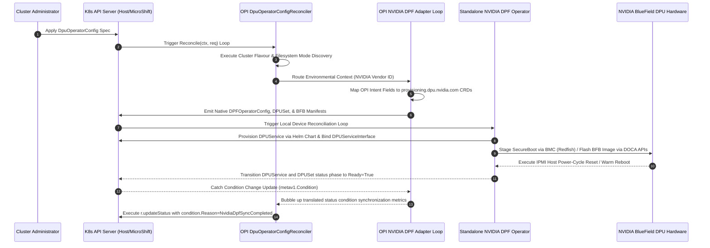

# Architecture Specification: Unified OPI & NVIDIA DPF Integration Engine
**Candidate:** Lipika Mandal  
**Track:** Linux Foundation OPI Project Internship 2026  

## 1. Architectural Integration Pattern: CRD Translation Adapter Pattern
To bridge NVIDIA BlueField DPU support into the unified, vendor-neutral OPI Operator ecosystem while maximizing code reuse, we implement an asynchronous **CRD Translation Adapter Pattern** integrated directly with the `controller-runtime` reconciler pipeline.

The master OPI controller implements `reconcile.Reconciler` to process cluster-scoped configs (`DpuOperatorConfig`) under the `config.openshift.io/v1` group. Rather than embedding vendor-specific driver bundles inside the primary reconciler loop, we inject an internal **NVIDIA DPF Translation Sub-Controller** into the execution pipeline right after the finalizer (`config.openshift.io/dpuoperatorconfig-finalizer`) validation gate passes.

Upon identifying a target node possessing an NVIDIA PCIe signature via node labels (`dpu=true`), the adapter acts as an active translation layer. It transforms abstract OPI declarations directly into native, tightly coupled NVIDIA DPF Custom Resources—such as `DPFOperatorConfig`, `DPUSet`, `BFB`, `DPUDeployment`, and `DPUService`—under the native `operator.doca-platform.nvidia.com` and `provisioning.dpu.nvidia.com` API groups. The standalone NVIDIA DPF Operator then intercepts these generated resources to execute direct low-level device provisioning, rolling infrastructure updates, security posture enforcement, and Helm-based application scheduling via the DOCA API framework.

## 2. Structural API & Environment Mapping Matrix
The table below maps the structural interface translations and environmental discovery parameters executed by the adapter controller loop to maintain cross-vendor feature parity:

| OPI Core Cluster Spec Entity / Hook | Translated NVIDIA DPF Native Target CRD | Operational Context & Low-Level Overrides |
| :--- | :--- | :--- |
| `DpuOperatorConfig` (LogLevel) | `DPFOperatorConfig` (`operator.doca-platform.nvidia.com`) | Configures system management flags, log levels, and out-of-band bridge overrides (`dpuNodeOOBBridgeName: br-dpu`). |
| `utils.NewClusterEnvironment` | `DPFOperatorConfig.spec.overrides` | Resolves target cluster flavours (`OpenShift`, `MicroShift`, `Kubernetes`) to configure matching API VIP networks. |
| `utils.NewFilesystemModeDetector` | `spec.overrides.dpuCNIPath` | Directs low-level file path mapping configuration arrays depending on detected filesystem isolation boundaries. |
| `resolveNriTLSProvider` (TLS Flow) | `DPUServiceCredentialRequest` | Coordinates webhook certificate verification using `openshift` service-ca or native `cert-manager` flows. |
| `openshift.io/dpu` (SFC Resource Req) | `DPUFlavor` / `DPUDeployment` | Matches exact hardware resource allocation constraints and higher-level application lifecycles. |
| Pipeline Firmware Upgrades | `DPUSet` & `BFB` (`provisioning.dpu.nvidia.com`) | Orchestrates asynchronous, rolling BFB image flashes, taints, and cold-boot power cycle commands (`://nvidia.com`). |
| Workload Deployment & HBN Fabrics | `DPUService` (`svc.dpu.nvidia.com`) | Manages Helm-based application delivery on the card, populating NVUE BGP startup configurations and `startupYAMLJ2` loopback strings. |
| Virtual Service Chains & Telemetry | `DPUServiceInterface` & `DPUServiceChain` | Maps virtual interfaces (`interfaceType: service`) and binds virtual switches directly to hardware uplinks (`p0`, `p1`). |

## 3. Structural Trade-Off Analysis

| Architectural Dimension | Option A: Monolithic Multi-Vendor Code Fork | Option B: CRD Translation Adapter (Selected) |
| :--- | :--- | :--- |
| **Code Reuse Efficiency** | Zero reuse. Forces manual re-implementation of complex DOCA system device interfaces. | Maximum efficiency. Reuses 100% of the active, production-proven standalone NVIDIA DPF operator layout. |
| **System Stability** | Low. A failure inside upstream vendor firmware scripts halts the entire unified OPI loop. | High. Hardware failure loops remain strictly isolated to the native NVIDIA subsystem namespace. |
| **Upstream Maintainability** | Poor. Any modification to NVIDIA's internal API schemas demands a core OPI refactoring cycle. | High. OPI remains decoupled, interacting strictly with top-level OpenShift custom specifications. |

## 4. Boundary Conditions & Status Reconciliation
The adapter maps lifecycle outcomes directly back to the OPI condition architecture using `metav1.Condition` specifications via the `sigs.k8s.io/controller-runtime` pipeline:
- **Immutable SecureBoot Mismatches (TerminalError Mapping):** If a mismatch is detected between the requested `secureBoot` boolean spec and the physical hardware registers under Trusted Host mode, the adapter intercepts the hardware's inability to self-configure and returns a `reconcile.TerminalError(wrapped)`. This stops the loop from triggering destructive reboot cycles while gracefully logging the crash telemetry in core cluster metrics.
- **Component Error Propagation:** If an error occurs during the creation of a downstream `DPUService` or `DPUSet`, the adapter captures the fault and constructs a structured `componentError{component: "NvidiaDpfSet", err: err}` instance, allowing `r.updateStatus` to write a clean `reason=NvidiaDpfSetError` status flag back to the API server.
